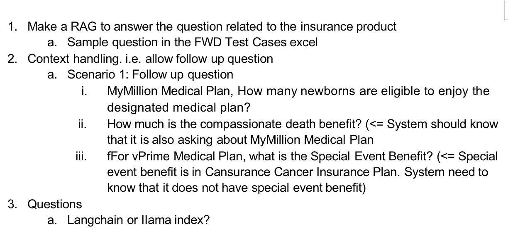

# langchain_document_qa
## Introduction
`MSBD5014` IP项目仓库，用`RAG`解决对pdf文档的长对话问答

## Features
### Chunking Tips

1. [做实验，看针对不同类型的文档，什么Splitter的效果更好](https://python.langchain.com/docs/modules/data_connection/document_transformers/)，可视化评估文本分割：Chunkviz
2. [提前提取文档中的信息](https://python.langchain.com/docs/integrations/document_transformers/doctran_extract_properties)
3. [向量化之前先做QA处理](https://python.langchain.com/docs/integrations/document_transformers/doctran_interrogate_document)
4. [使用Google云平台的文档理解功能](https://python.langchain.com/docs/integrations/document_transformers/google_docai)，使用DocAI pdf解析引擎将非结构化数据转换为结构化数据
5. [如果是视频、图片等非结构化的文档，可以考虑引入Nuclia](https://python.langchain.com/docs/integrations/document_transformers/nuclia_transformer)
6. [接入OpenAI，对文档进行元数据自动化标注](https://python.langchain.com/docs/integrations/document_transformers/openai_metadata_tagger)

## Current Problems
- 模型不知道问的是哪个文档
- 存在记忆丢失的情况
- 存在幻觉问题，即把用户的输入作为真实情况
- pdf中的内容格式不固定，有一些是表格，有一些是带角标的文字，在做Embedding的过程中可能会混淆

## TODO:
1. 跑通RAG全流程
2. 解决当前项目存在问题
3. 开发前端页面
4. 引入Elasticsearch向量检索